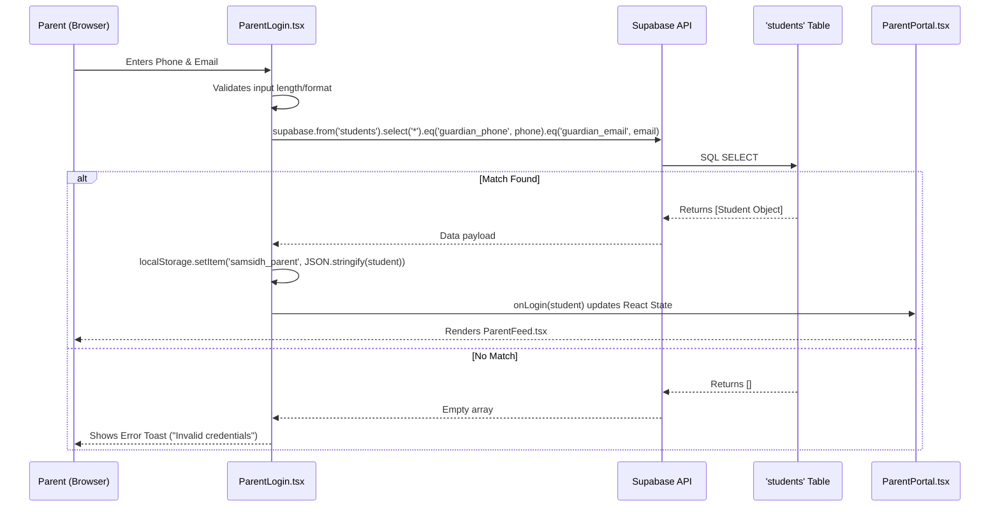
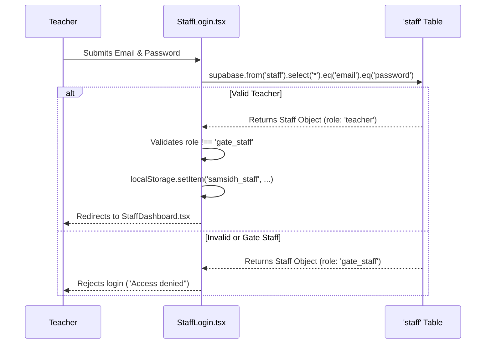
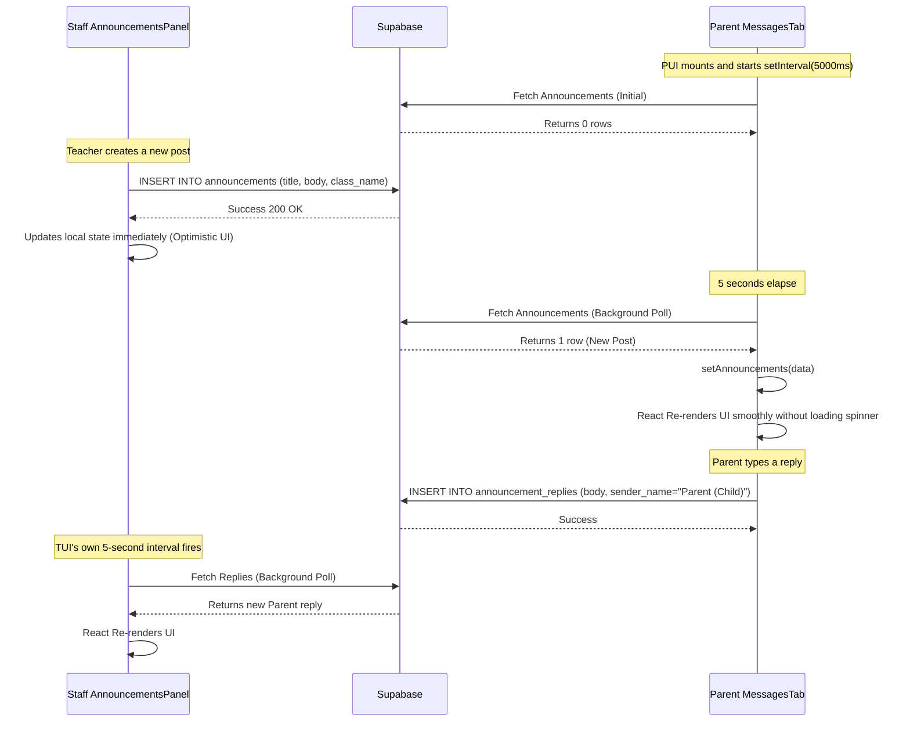
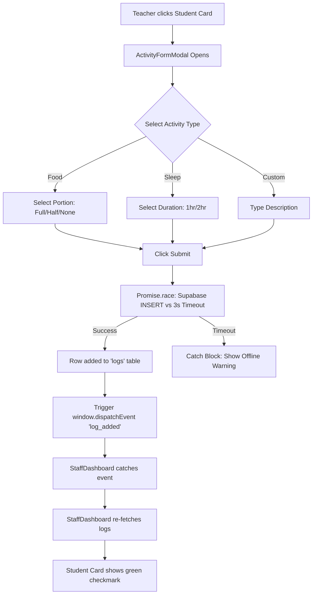
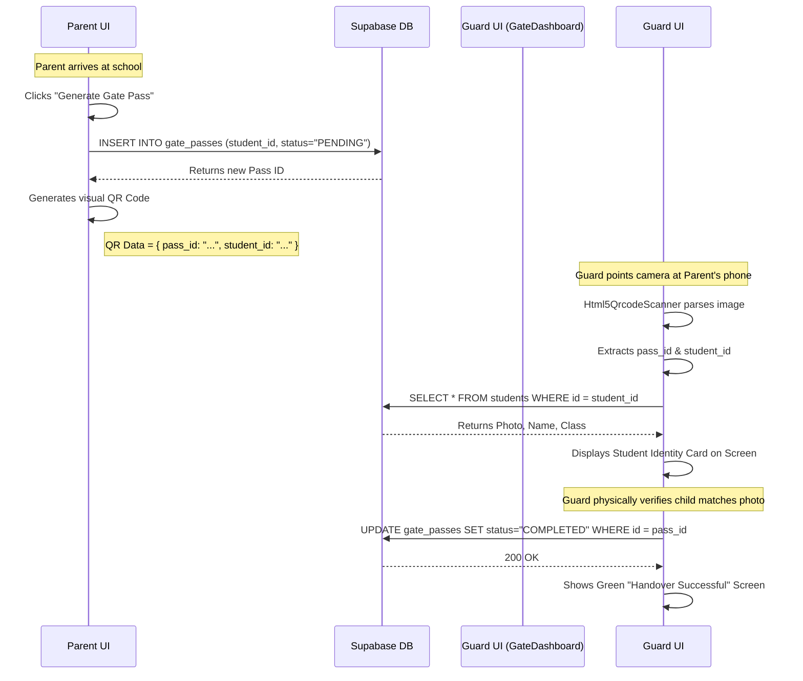
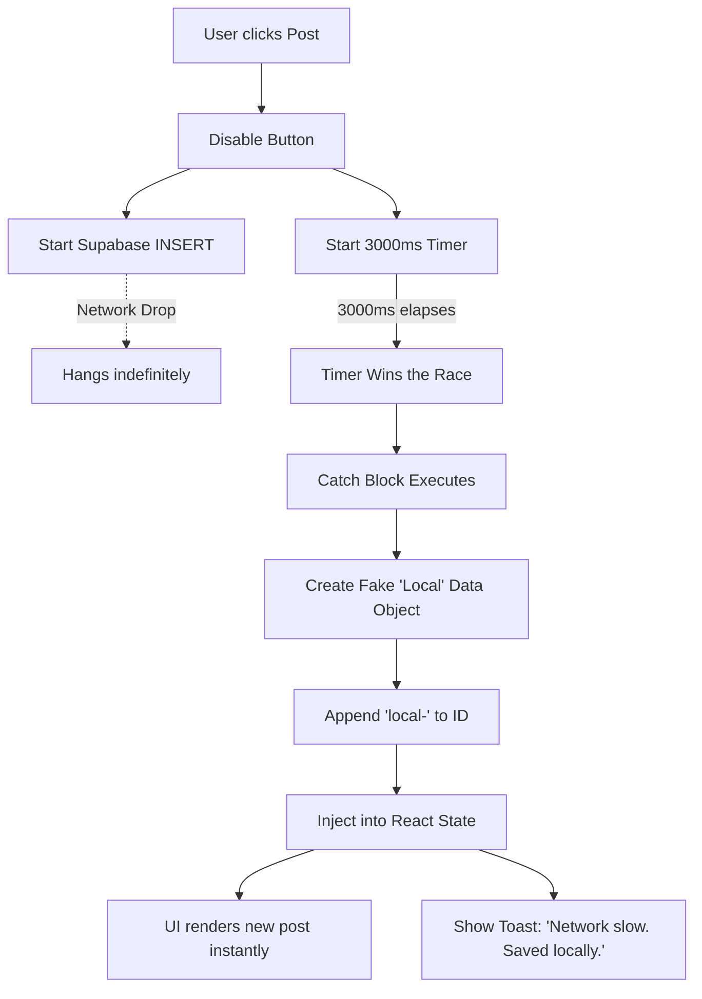

# SAMSIDH PRESCHOOL APP: INTERNAL DATA FLOWS & REQUEST LIFECYCLES

This document is an extreme deep-dive into the internal request cycles, component lifecycles, and database interactions of the Samsidh Preschool Application. It maps out exactly how data moves from the user's screen (Frontend React Components) across the network to the database (Supabase) and back to other users.

---

## 1. AUTHENTICATION & SESSION DATA FLOW

The application does not use traditional session cookies or JWT tokens for its primary portals. Instead, it relies on a local state mechanism verified against database records. 

### 1.1 Parent Login Flow
When a parent attempts to log in, the system validates their phone number and email against the `students` table to find their child.

### 1.2 Staff Authentication Flow
Staff login explicitly relies on the `staff` table and validates the role.

---

## 2. REAL-TIME DATA SYNC (THE POLLING MECHANISM)

Because WebSockets (Realtime) are disabled by default on new Supabase tables, the application guarantees "real-time" chat feeling via a 5-second background polling cycle.

### 2.1 The Polling Lifecycle (Announcements & Replies)
This flow explains how a Teacher's post instantly appears on a Parent's phone without the parent refreshing the page.

**Technical Responsibility Deep-Dive:**
*   **`useEffect` Hooks:** Inside `MessagesTab.tsx`, `HomeworkTab.tsx`, `AnnouncementsPanel.tsx`, and `HomeworkPanel.tsx`, there is a `useEffect` hook with an empty dependency array or a `class_name` dependency. This ensures the 5-second interval is created exactly once when the component is mounted to the DOM, and it is destroyed (`clearInterval`) when the user navigates away, preventing memory leaks.
*   **Zero-Flicker Updates:** The `setLoading(true)` state is deliberately bypassed during the interval loops. When `setAnnouncements(data)` is called with new data, React's Virtual DOM calculates the exact difference (e.g., one new chat bubble) and injects only that element into the browser's DOM, resulting in a buttery-smooth sync.

---

## 3. DAILY LOGS ARCHITECTURE

Teachers log activities for students (Food, Sleep, Custom). Parents view this as a timeline.

### 3.1 The Activity Submission Lifecycle

**Database Schema Enforcement:**
*   The `logs` table strictly requires a `student_id`. Supabase enforces this at the database level. If `ActivityFormModal.tsx` attempts to send a log without an ID, the PostgREST API immediately rejects it with a 400 Bad Request.

---

## 4. SECURE GATE PASS (QR CODE) LIFECYCLE

The most critical security feature of the app. It ensures a child cannot be released without cryptographic verification.

### 4.1 End-to-End Handover Flow

**Technical Responsibility Deep-Dive:**
*   **`ParentGatePassModal.tsx`:** Uses the `qrcode.react` library to convert a JSON payload string into a 2D barcode canvas on the fly. 
*   **`GateDashboard.tsx`:** Relies on the `html5-qrcode` library. This library requests DOM access to the physical device camera via `navigator.mediaDevices.getUserMedia()`, processes video frames 10 times a second, and applies optical character recognition algorithms to find barcode anchor points.

---

## 5. NETWORK FAILURE & RESILIENCE (OPTIMISTIC UI)

The application is built for environments where Wi-Fi or 4G data might drop unexpectedly.

### 5.1 The Offline Creation Flow
When a user attempts to send data without an internet connection, the system utilizes "Optimistic UI" combined with `Promise.race()`.

*Note: True persistence of "offline-first" data requires a Service Worker Background Sync or IndexedDB cache. Currently, the app relies on this in-memory optimistic update to prevent UI freezing, meaning a hard refresh while offline will lose the unsynced post.*
