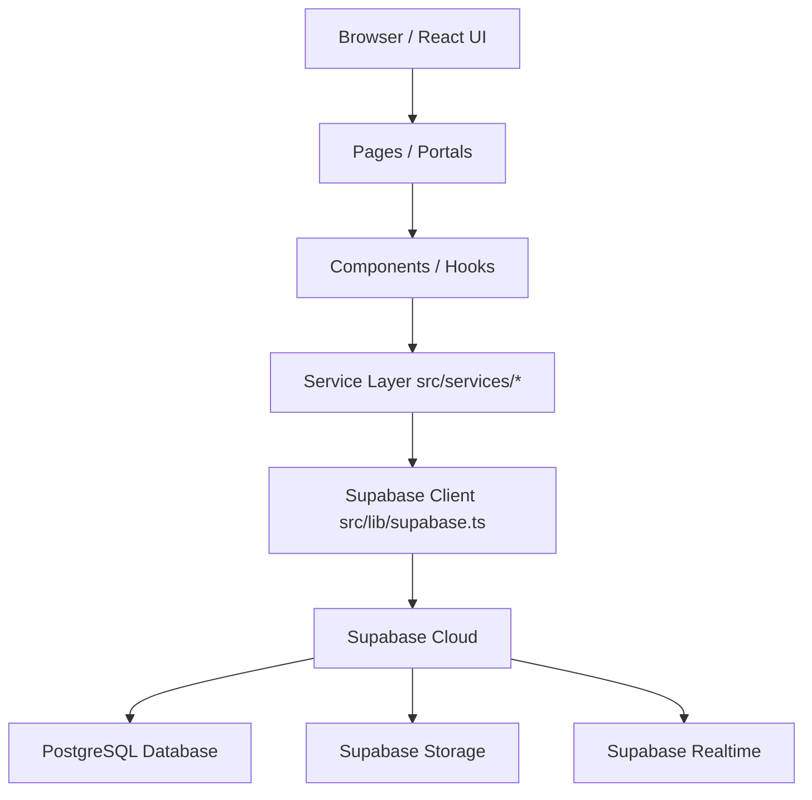

# 03 System Architecture

## Architecture Overview
The application follows a standard React SPA architecture with a Service Layer abstracting database interactions.

## Layers

### 1. React UI (Pages & Components)
**Responsibility:** Rendering the interface, capturing user input, managing component state.
**Rules:** UI should NOT directly implement database queries. It must call the Service Layer.

### 2. Service Layer (`src/services/`)
**Responsibility:** Business logic, data transformation, and interaction with Supabase.
**Rules:** All database queries, insertions, and realtime configurations (mostly) should pass through or be managed by these services. They handle timeouts and logging.

### 3. Supabase Client (`src/lib/supabase.ts`)
**Responsibility:** Maintains the single shared connection to the Supabase backend using the Anon Key.

### 4. Supabase Backend
**Responsibility:** Data persistence (PostgreSQL), file storage (Storage), and pub/sub events (Realtime).
**Rules:** Secures data via Row Level Security (RLS) policies.
