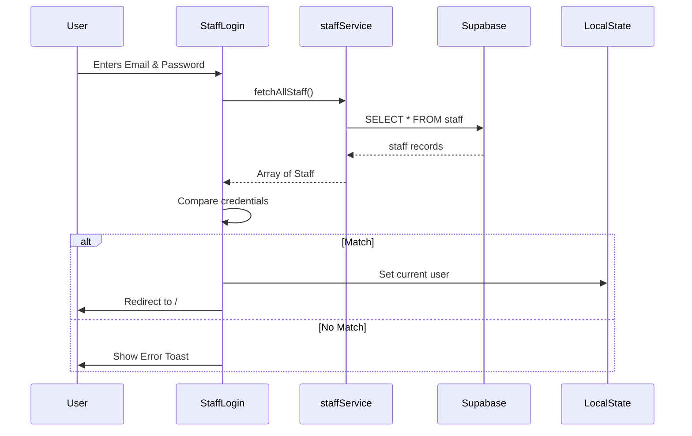
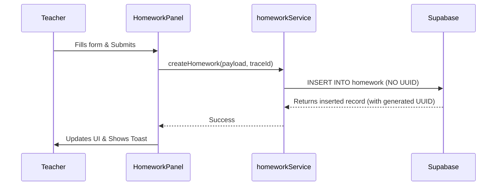

# 04 Application Flow

## Staff Login Flow

```mermaid
sequenceDiagram
    participant User
    participant StaffLogin
    participant staffService
    participant Supabase
    participant LocalState

    User->>StaffLogin: Enters Email & Password
    StaffLogin->>staffService: fetchAllStaff()
    staffService->>Supabase: SELECT * FROM staff
    Supabase-->>staffService: staff records
    staffService-->>StaffLogin: Array of Staff
    StaffLogin->>StaffLogin: Compare credentials
    alt Match
        StaffLogin->>LocalState: Set current user
        StaffLogin->>User: Redirect to /#/staff
    else No Match
        StaffLogin->>User: Show Error Toast
    end
```

## Homework Assignment Flow

```mermaid
sequenceDiagram
    participant Teacher
    participant HomeworkPanel
    participant homeworkService
    participant Supabase

    Teacher->>HomeworkPanel: Fills form & Submits
    HomeworkPanel->>homeworkService: createHomework(payload, traceId)
    homeworkService->>Supabase: INSERT INTO homework (NO UUID)
    Supabase-->>homeworkService: Returns inserted record (with generated UUID)
    homeworkService-->>HomeworkPanel: Success
    HomeworkPanel->>Teacher: Updates UI & Shows Toast
```

*(Detailed flows for Parent login, Announcements, Gate Pass, etc., follow similar Service-Layer patterns).*
